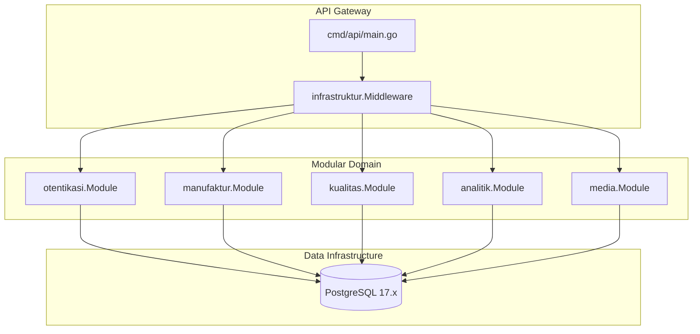

# PGNServer - Manufacturing Traceability & Advanced Analytics Engine 🚀

[](https://github.com/bonecom-group/pgn-server/actions/workflows/ci.yml)
[](https://go.dev)
[](https://www.postgresql.org)
[](#)

Introduce **PGNServer**, *literally* the ultimate *modular monolith backend* yang dirancang *highly robust* untuk mengawal tata niaga manufaktur dan inspeksi kualitas (*Quality Control*) berstandar Toyota Production System (TPS). Di-build dengan **Go 1.25.x** (with `GOEXPERIMENT=jsonv2` enabled) dan **PostgreSQL 17.x**, sistem ini memberikan *performance benchmark* kelas wahid dengan *strict transaction integrity* demi *zero-defect tolerance*.

---

## 🏗️ Monolithic Modular Architecture

Aplikasi ini mengadopsi pola *Clean Architecture* dan *Domain-Driven Design (DDD)* untuk mengisolasi fungsionalitas bisnis secara modular, *which is* sangat memudahkan tim untuk *scaling up* fitur tanpa menimbulkan *dependency hell*.



### Module Breakdown:
*   **`cmd/api/`**: The absolute entrypoint. Mengatur inisialisasi koneksi DB, dependency injection, routing, serta *graceful logging*.
*   **`internal/otentikasi/`**: Keamanan tingkat tinggi menggunakan **JWT v5** dan enkripsi *bcrypt*. Menyediakan proteksi *Role-Based Access Control (RBAC)* ketat khusus role **Leader QC**.
*   **`internal/manufaktur/`**: Mengelola *Master Data* utama seperti `customers`, `suppliers` (Pemasok), `MATERIAL` (Material & Finished Good), dan `bill_of_materials` (BOM).
*   **`internal/kualitas/`**: Inti operasional kontrol kualitas (*Quality Control*). Merekam checksheet secara atomik dengan *zero-loop* memanfaatkan fungsi native PostgreSQL `jsonb_to_recordset`.
*   **`internal/analitik/`**: Engine analitik premium 7 QC Tools. Menghitung Pareto Defect secara dinamis menggunakan *PostgreSQL 17 Window Functions* serta melacak akar masalah cacat material (*BOM Tracing*).
*   **`internal/media/`**: Manajemen berkas gambar dengan perlindungan *Dual-Default Fallback* yang *literally* aman dari aksi penghapusan tidak disengaja.

---

## 🚀 Key Value Propositions (Feature Unggulan)

### 📊 1. PostgreSQL 17 Window-Powered Pareto Analytics
Kami meniadakan looping array lambat di level aplikasi Go. Kalkulasi rasio cacat kumulatif dilakukan langsung di pangkalan data melalui kueri analitik canggih menggunakan *SQL Window Function* `SUM(rasio_cacat) OVER (ORDER BY ...)`:
> [!TIP]
> Hal ini *literally* menghemat memori alokasi (0 allocations in Go) dan menjamin pengurutan Pareto 80/20 yang *lightning-fast* bahkan ketika mengolah jutaan baris data secara realtime.

### 🌳 2. Auto-Trace NG & Recursive BOM Tracing
Ketika inspektur menemukan produk NG (*No Good*), sistem secara rekursif menelusuri pohon Bill of Materials (BOM) untuk mendeteksi material pembentuk dan pemasok (*supplier*) asalnya.
*   **Circular Reference Shield**: Dilengkapi *visited map validation* untuk mendeteksi *circular dependency* (A → B → A) secara otomatis dan memutus putaran tak terbatas sebelum memicu *stack overflow*.
*   **Toyota-Style Internal Defect Resolver**: Jika cacat tergolong `PROCESS`, sistem secara pintar memetakannya sebagai *Internal Process Defect* disuplai oleh *Internal Production Line*.

### ⚡ 3. Single-Atomic Transmisi Lembar Periksa (Zero-Loop Batch Write)
Merekam ribuan baris checksheet cacat sekaligus dalam satu kali jalan menggunakan PostgreSQL native **`jsonb_to_recordset`**:
```sql
INSERT INTO detail_inspeksis (lembar_periksa_id, unik_part_id, kode_cacat, waktu_pergeseran, rasio_cacat, rasio_total_ok)
SELECT ?, "unikPartId", "kodeCacat", "waktuPergeseran", "rasioCacat", "rasioTotalOK"
FROM jsonb_to_recordset(?::jsonb) AS x(...)
```
> [!NOTE]
> Menghilangkan masalah laten N+1 queries. Seluruh detail inspeksi dimasukkan secara atomik dalam satu transaksi pangkalan data, *which is* dilindungi oleh `tx.Rollback()` jika terjadi kegagalan sekecil apa pun.

### 🛡️ 4. Dual-Default Media Protection
Modul media dilengkapi pertahanan ganda:
1.  **Dynamic PNG Builder**: Secara otonom mendeteksi dan menciptakan berkas 1x1 piksel dummy `part.png` dan `avatar.png` pada saat *startup* jika berkas asli absen di server.
2.  **Deletion Guard**: Mencegah penghapusan berkas cadangan default oleh siapa pun melalui API, sehingga sistem terbebas dari ancaman *blank image crash*.

---

## ⚙️ Quick Start & Production Setup

### 1. Kebutuhan Environment (`.env`)
Salin atau buat berkas `.env` di direktori utama proyek dengan konfigurasi berikut:
```env
DB_HOST=localhost
DB_PORT=5432
DB_USER=admin
DB_PASSWORD=admin
DB_NAME=pgn_db
APP_PORT=8080
JWT_SECRET=pgn-rahasia-korporat-2026
GIN_MODE=debug
```

### 2. Kompilasi & Menjalankan Kontainer Docker (Production-Ready)
Kami menyediakan multi-stage `Dockerfile` berbasis *Alpine Linux* yang di-hardening secara ketat dengan *Non-Root User* (`pgnuser`) untuk meminimalkan *attack surface*.

Volume database kini dipetakan secara fisik ke `./docker/pgdata` untuk menjamin ketahanan persisten jika kontainer direstart atau dimatikan tanpa sengaja via `docker compose down -v`.

Jalankan seluruh infrastruktur (Database Postgres 17 & API Server) hanya dengan satu perintah:
```bash
docker-compose up -d --build
```

### 3. Eksekusi Pengujian Otomatis (Testing Pyramid)
Untuk menjamin integritas kode saat *refactoring*, jalankan seluruh suite pengujian integrasi (termasuk validasi database, window function, circular tracing, dan RBAC):
```bash
go test -v -race ./...
```

---

## 🗄️ Disaster Recovery & Manual Database Backup

Demi mencegah kehilangan data historis inspeksi kualitas akibat kesalahan operasional lokal, kami menyertakan utilitas backup otomatis. 

Jalankan backup data manual secara berkala dengan perintah:
```bash
# Berikan izin eksekusi jika berjalan di Linux/macOS
chmod +x scripts/backup_db.sh

# Eksekusi skrip backup
./scripts/backup_db.sh
```
> [!NOTE]
> Skrip ini secara otomatis mendeteksi apakah database berjalan di dalam container Docker `pgn_db` atau lokal host, lalu mengekstrak skema dan data transaksi ke dalam direktori aman `./docker/backups/` dengan penamaan terstruktur berbasis timestamp. File dump SQL ini terlindung di dalam `.gitignore`.

---

## 🗺️ REST API Endpoints Specification & Integration Matrix

Server API PGNServer kini secara resmi dinyatakan **"Siap di-Consume"** untuk integrasi penuh dengan tim Frontend dan Client Apps (seperti QControl Desktop Client).

Seluruh endpoint API berjalan di bawah routing group `/api/v1` dan mengembalikan amplop respon JSON terstandardisasi:
- **Respon Sukses**: `{"success": true, "message": "...", "data": ..., "meta": null}`
- **Respon Gagal / Galat**: `{"success": false, "message": "...", "errors": ["..."]}`

### 1. Modul Sistem & Pemeriksaan Kesehatan (Public)

| Metode | Path | Otorisasi | Peran Akses | Payload Request | Struktur Respon Data |
| :--- | :--- | :--- | :--- | :--- | :--- |
| `GET` | `/` | Public | Public | *None* | Halaman HTML interaktif Dashboard telemetry |
| `GET` | `/swagger/*any` | Public | Public | *None* | Dokumentasi UI Swagger interaktif |
| `GET` | `/api/v1/health` | Public | Public | *None* | Pesan string liveness server |
| `GET` | `/api/v1/readiness` | Public | Public | *None* | Status kesiapan database ping |
| `GET` | `/api/v1/cek_sistem` | Public | Public | *None* | Telemetri runtime GORM & RAM sistem |
| `GET` | `/api/v1/krusial/status` | IP Whitelist | Admin / LEADER | *None* | Data telemetri operasi tingkat tinggi |

### 2. Modul Otentikasi & Manajemen Sesi (Stateless JWT v5)

| Metode | Path | Otorisasi | Peran Akses | Payload Request | Struktur Respon Data |
| :--- | :--- | :--- | :--- | :--- | :--- |
| `POST` | `/api/v1/otentikasi/daftar` | Public | Public | `{"surel": "surel@pgn.com", "sandi": "sandi123", "peran": "LEADER", "nip": "2211019", "kata_sandi": "sandi123"}` | Objek profil pengguna baru yang didaftarkan |
| `POST` | `/api/v1/otentikasi/masuk` | Public | Public | `{"surel": "surel@pgn.com", "sandi": "sandi123", "nip": "2211019", "kata_sandi": "sandi123"}` | `{"token_akses": "jwt_token", "peran": "LEADER", "nip": "2211019"}` |
| `POST` | `/api/v1/otentikasi/lupa-sandi` | Public | Public | `{"surel": "surel@pgn.com"}` | Informasi pengiriman reset link |
| `POST` | `/api/v1/otentikasi/keluar` | Public | Public | *None* | Konfirmasi penghapusan sesi kuki/lokal |

### 3. Modul Kualitas & Transmisi Lembar Periksa (TPS Compliant)

> [!IMPORTANT]
> - Semua request di bawah ini wajib menyertakan Header: `Authorization: Bearer <JWT_TOKEN>`.
> - Total produksi checksheet wajib mematuhi **Hukum TPS**: `TotalProduksi == KuantitasOK + KuantitasNG`.

| Metode | Path | Otorisasi | Peran Akses | Payload Request | Struktur Respon Data |
| :--- | :--- | :--- | :--- | :--- | :--- |
| `POST` | `/api/v1/operasi/rekam_lembar_periksa` | JWT | OPERATOR / LEADER | `{"tanggal": "2026-05-17", "zona_lini": "Lini A", "kuantitas_ok": 150, "kuantitas_ng": 12, "detail_inspeksi": [{"unikPartId": 1, "kodeCacat": "NG01", "waktuPergeseran": "Pagi", "rasioCacat": 5, "rasioTotalOK": 145}]}` | Konfirmasi penyimpanan atomik lembar periksa |
| `GET` | `/api/v1/operasi/riwayat_lembar_periksa` | JWT | OPERATOR / LEADER | Query: `limit`, `offset`, `tanggal_mulai`, `tanggal_selesai`, `zona_lini` | Array riwayat data inspeksi terpaginasi |

### 4. Modul Analitik 7 QC Tools & Root-Cause Tracing (BOM Engine)

| Metode | Path | Otorisasi | Peran Akses | Payload Request | Struktur Respon Data |
| :--- | :--- | :--- | :--- | :--- | :--- |
| `GET` | `/api/v1/analitik/metrik_pareto_bulanan` | Public | Public | Query: `bulan` (1-12, default saat ini) | Array kontribusi defect 80/20 terurut kumulatif |
| `GET` | `/api/v1/analitik/pareto` | Public | Public | Query: `limit`, `offset` | Data pareto analitik umum |
| `GET` | `/api/v1/analitik/lacak` | Public | Public | Query: `material_id` (Wajib) | Struktur pohon kegagalan (Trace Tree) rekursif |

### 5. Modul Media & Attachment Inspeksi (Dual-Default Protection)

| Metode | Path | Otorisasi | Peran Akses | Payload Request | Struktur Respon Data |
| :--- | :--- | :--- | :--- | :--- | :--- |
| `GET` | `/api/v1/media/:id/pratinjau` | Public | Public | Path parameter: `id` media | Mengembalikan binary payload file gambar (PNG/JPG) |
| `POST` | `/api/v1/materials/:id/media` | JWT | OPERATOR / LEADER | Multipart Form: `berkas` (File gambar) | Metadata gambar yang tersimpan aman |

### 6. Modul Master Data Manufaktur (RBAC Proteksi JWT)

| Metode | Path | Otorisasi | Peran Akses | Payload Request | Deskripsi Operasi |
| :--- | :--- | :--- | :--- | :--- | :--- |
| `POST` | `/api/v1/suppliers` | JWT | LEADER | `{"kode_pemasok": "SUP01", "nama": "PT Baja Utama", "alamat": "Jakarta", "kontak": "0812..."}` | Menambah pemasok baru |
| `GET` | `/api/v1/suppliers` | JWT | OPERATOR / LEADER | *None* | Mengambil daftar semua pemasok |
| `GET` | `/api/v1/suppliers/:id` | JWT | OPERATOR / LEADER | Path Parameter: `id` | Mengambil detail pemasok |
| `PUT` | `/api/v1/suppliers/:id` | JWT | LEADER | `{"nama": "PT Baja Utama Baru", "alamat": "Jakarta Barat"}` | Memperbarui data pemasok |
| `DELETE` | `/api/v1/suppliers/:id` | JWT | LEADER | *None* | Menghapus data pemasok |
| `POST` | `/api/v1/materials` | JWT | LEADER | `{"kode_material": "MAT01", "nama": "Besi Hollow", "tipe": "RAW", "pemasok_id": 1}` | Menambah bahan baku/produk |
| `GET` | `/api/v1/materials` | JWT | OPERATOR / LEADER | *None* | Mengambil daftar semua material |
| `GET` | `/api/v1/materials/:id` | JWT | OPERATOR / LEADER | Path Parameter: `id` | Mengambil detail material |
| `PUT` | `/api/v1/materials/:id` | JWT | LEADER | `{"nama": "Besi Hollow Premium"}` | Memperbarui data material |
| `DELETE` | `/api/v1/materials/:id` | JWT | LEADER | *None* | Menghapus data material |
| `POST` | `/api/v1/customers` | JWT | LEADER | `{"kode_pelanggan": "CUST01", "nama": "PT Astra", "alamat": "Cikarang"}` | Menambah pelanggan baru |
| `GET` | `/api/v1/customers` | JWT | OPERATOR / LEADER | *None* | Mengambil daftar semua pelanggan |
| `GET` | `/api/v1/customers/:id` | JWT | OPERATOR / LEADER | Path Parameter: `id` | Mengambil detail pelanggan |
| `PUT` | `/api/v1/customers/:id` | JWT | LEADER | `{"nama": "PT Astra Tbk"}` | Memperbarui data pelanggan |
| `DELETE` | `/api/v1/customers/:id` | JWT | LEADER | *None* | Menghapus data pelanggan |
| `POST` | `/api/v1/boms` | JWT | LEADER | `{"produk_id": 1, "material_id": 2, "kuantitas_komposisi": 2.5}` | Membuat link BOM komposisi |
| `GET` | `/api/v1/boms` | JWT | OPERATOR / LEADER | *None* | Mengambil semua komposisi BOM |
| `GET` | `/api/v1/boms/:id` | JWT | OPERATOR / LEADER | Path Parameter: `id` | Mengambil detail komposisi BOM |
| `PUT` | `/api/v1/boms/:id` | JWT | LEADER | `{"kuantitas_komposisi": 3.0}` | Memperbarui kuantitas BOM |
| `DELETE` | `/api/v1/boms/:id` | JWT | LEADER | *None* | Menghapus komposisi BOM |

---

## 🛠️ Panduan Local Development & Kompilasi Swagger

### 1. Inisialisasi Lokal
Untuk menjalankan server secara manual di mesin lokal (tanpa Docker):
1.  **Siapkan Database**: Pastikan PostgreSQL 17.x aktif dengan database `pgn_db` dan pengguna `admin:admin`.
2.  **Salin Environtment**:
    ```bash
    copy .env.example .env
    ```
3.  **Jalankan Aplikasi**:
    ```bash
    go run cmd/api/main.go
    ```
    *Database schema migration dan seeding data dummy akan dieksekusi secara otomatis pada saat startup.*

### 2. Kompilasi & Regenerasi Swagger UI
Jika Anda memodifikasi rute, anotasi gin, atau deskripsi param pada handler, regenerasi dokumentasi Swagger dengan:
1.  **Instal Swag CLI**:
    ```bash
    go install github.com/swaggo/swag/cmd/swag@latest
    ```
2.  **Jalankan Swag Init** di direktori utama:
    ```bash
    swag init -g cmd/api/main.go
    ```
3.  Restart server untuk memuat Swagger UI terbaru di `/swagger/index.html`.

### 3. Pengujian Endpoint dengan REST Client (`test.http`)
Kami menyertakan file [test.http](file:///C:/Software/PGNServer/test.http) di root repositori. Anda dapat mengeksekusi langsung kueri HTTP dari VSCode dengan ekstensi REST Client untuk:
- Menguji alur otentikasi login/registrasi.
- Mengirim lembar periksa berukuran besar (*batch write*).
- Menambah, mengubah, dan menghapus master data (Pemasok, Material, Pelanggan, BOM).
- Memverifikasi output Window Functions Pareto dan rekursi BOM Tracing.

---

## 🔒 SOP Pengembangan & Kebijakan Rilis Beta

Demi menjaga stabilitas sistem selama fase rilis *Beta Production*, seluruh kontributor wajib mematuhi aturan berikut secara ketat:

| Kategori SOP | Kebijakan & Aturan Teknis | Dampak & Konsekuensi |
| :--- | :--- | :--- |
| **No-Branching** | Semua commit & push wajib langsung ke cabang `main`. Dilarang membuat cabang fitur baru secara terpisah. | Continuous Integration yang linier, bebas konflik penggabungan (*merge conflict*). |
| **Nomenklatur** | Variabel, skema model, dan endpoint wajib memakai Bahasa Indonesia sesuai Pedoman Umum Ejaan Bahasa Indonesia (PUEBI). | Kemudahan telusur (*traceability*) secara manajerial operasional internal. |
| **Security First** | Endpoint penulisan / mutasi data wajib melampirkan valid token JWT dengan klaim role khusus `Leader QC` (NIP default: `2211019`). | Mencegah penyalahgunaan data kualitas oleh pihak non-otoritas. |
| **Silent Git** | Jejak biner kompilasi (`*.exe`), session profiling (`.vscode/`), dan temporary file wajib diisolasi di `.gitignore`. | Menjaga kebersihan repositori awan dari berkas-berkas sampah. |

---
*PGN Quality Assurance & Database Architecture Dept. - Hak Cipta Dilindungi © 2026*
